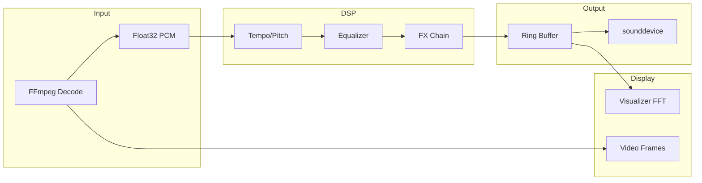

# TempoPitch Music Player

A Windows desktop music player built with PySide6 that lets you change tempo and pitch in real time during playback. It uses the SoundTouch DSP library for high-quality time-stretching and pitch-shifting, with a built-in phase vocoder fallback if SoundTouch is unavailable.

---

## Features

### Core Playback
- Real-time tempo control (0.5x to 2.0x) and pitch control (-12 to +12 semitones)
- Key lock, tape mode, and A4=432 Hz pitch lock options
- Shuffle and repeat modes (off/all/one)
- Gapless playback with ring buffer audio output

### Media Library
- SQLite-backed media library with persistent storage
- Browse by artist or album in the sidebar
- Full-text search across title, artist, and album
- Play count tracking with last played timestamps
- Row highlighting for currently playing track
- Context menu with "Show in Explorer" and "Remove from Library" options
- Batch folder scanning with progress indication
- Duplicate file detection (prevents adding the same file twice)

### FX Chain
- **10-band Equalizer** with presets
- **Dynamic EQ** - Frequency-targeted compression
- **Compressor** - Threshold, ratio, attack/release, makeup gain
- **Saturation** - Analog-style warmth with drive, trim, and tone controls
- **Subharmonic Synthesizer** - Bass enhancement with mix, intensity, and cutoff
- **Limiter** - Brick-wall limiting with adaptive release
- **Reverb** - Decay, pre-delay, and wet mix
- **Chorus** - Rate, depth, and mix controls
- **Stereo Width** - Expand or narrow the stereo field
- **Stereo Panner** - Azimuth and spread controls

### Visualization
- **Spectrum Analyzer** - Real-time FFT frequency display
- **Stereo Loudness Meter** - Horizontal L/R level meters
- Click to toggle between visualization modes
- Album art display with fallback to embedded artwork

### Video Support
- Video playback for mp4, mkv, mov, webm, avi containers
- Pop-out video window for expanded viewing
- Synchronized audio-video playback with tempo/pitch adjustments

### Metadata & Cover Art
- Local tag reading via FFprobe (artist, album, title, genre, year, track number)
- Embedded artwork extraction via FFmpeg
- **AcoustID Fingerprinting** - Audio fingerprint-based song identification using Chromaprint
- **Online metadata enrichment** from iTunes and Deezer APIs
- Smart matching using tag hints to reduce false positives
- Cached metadata to avoid repeated network requests

### Themes
Nine built-in color themes:
- Ocean, Sunset, Forest, Rose, Slate, Daylight, Aurora, Ember, Mono

### Configuration
- Audio buffer presets (latency vs stability trade-off)
- Effect enable/disable toggles with state persistence
- Session restore for playlist and playback position

---

## Requirements

- Windows 64-bit
- Python 3.10+
- FFmpeg installed and available on PATH
- FFprobe available on PATH (recommended for duration and tags)
- SoundTouch DLL (included) or other SoundTouch library

### Python Packages

```bash
pip install PySide6 numpy sounddevice scipy numba musicbrainzngs
```

Verify FFmpeg:

```bat
ffmpeg -version
ffprobe -version
```

---

## Run

### Option A - One-click launcher (recommended)

Double-click:

- `RUN_Player.bat`

### Option B - From a terminal

```bat
python app.py
```

---

## Controls and Shortcuts

| Shortcut | Action |
|----------|--------|
| Space | Play/Pause |
| Ctrl+O | Open files |
| Ctrl+L | Open folder |
| Ctrl+N | Next track |
| Ctrl+P | Previous track |
| Ctrl+Left/Right | Seek ±10s |

---

## Supported Formats

FFmpeg determines playable formats. Common ones include:

**Audio:** mp3, wav, flac, ogg, m4a, aac, wma, opus, aiff

**Video:** mp4, mkv, mov, webm, avi

If FFmpeg can decode it, the player can likely play it.

---

## Configuration

### Environment Variables

| Variable | Description | Default |
|----------|-------------|---------|
| `SOUNDTOUCH_DLL` | Path to SoundTouch library | `./SoundTouchDLL/SoundTouchDLL_x64.dll` |
| `TEMPOPITCH_DSP` | DSP backend selection | `auto` (options: `auto`, `soundtouch`, `phasevocoder`) |

---

## Metadata and Artwork

- Local tags and duration are read via `ffprobe`
- Embedded artwork is extracted via `ffmpeg`
- AcoustID fingerprinting identifies songs by audio content (requires `fpcalc.exe`)
- Online metadata and cover art are fetched from iTunes and Deezer when available
- Tag hints (from local metadata) are used to select the best match and avoid overwriting correct data
- Results are cached in `metadata/cache/` to avoid repeated network calls

Video files skip online metadata lookups by default.

---

## Project Structure

```
TempoPitch-Music-Player/
├── app.py                 # Application entry point
├── audio/
│   └── engine.py          # Audio playback engine
├── dsp.py                 # DSP effects chain (EQ, compressor, etc.)
├── library.py             # Media library service
├── library_db.py          # SQLite database layer
├── metadata/
│   ├── acoustid_lookup.py # AcoustID fingerprint identification
│   ├── local_probe.py     # FFprobe metadata extraction
│   └── online_fetch.py    # iTunes/Deezer API integration
├── models.py              # Data models and themes
├── ui/
│   ├── main_window.py     # Main application window
│   ├── library_widget.py  # Media library browser
│   └── widgets.py         # UI components (visualizer, controls)
├── buffers.py             # Ring buffer implementation
├── config.py              # Configuration handling
├── theme.py               # Theme stylesheet generation
└── utils.py               # Utility functions
```

---

## Troubleshooting

### FFmpeg not found in PATH

Install FFmpeg and ensure these work in Command Prompt:

```bat
ffmpeg -version
ffprobe -version
```

### No audio / `sounddevice` errors

`sounddevice` uses PortAudio. Make sure:

- Your output device is working
- Your environment allows audio device access

### SoundTouch DLL load errors

Common causes:

- Running 32-bit Python with a 64-bit DLL
- DLL moved or renamed

Fix:

- Install 64-bit Python
- Keep `SoundTouchDLL/SoundTouchDLL_x64.dll` in place or set `SOUNDTOUCH_DLL`

### AcoustID not working

Ensure `fpcalc.exe` is present in the project root directory. The Chromaprint fingerprinting binary is required for audio identification.

---

## Architecture (High Level)



- **Decode thread** runs FFmpeg to output float32 PCM
- **Tempo/Pitch DSP** via SoundTouch or phase vocoder fallback
- **EQ and FX chain** processing before audio output
- **Audio output** via sounddevice OutputStream with ring buffer
- **Visualizer** reads recent audio frames for FFT display
- **Video frames** decoded via FFmpeg when the track has video

---

## License

No license specified yet. Add one if you plan to distribute.
